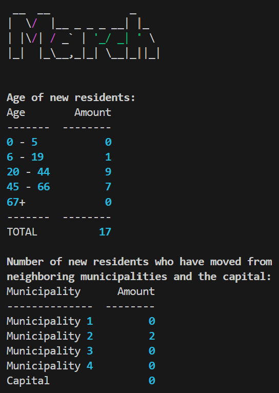

# Municipal Newcomer Statistics Tool
Author: [@adias01](https://github.com/adias01)

#### Description:
A Python program that iterates over text files (.txt) in the text_files directory and converts those files to CSV files for further processing. Statistics is then generated and written to the CSV file on parent level and outputted in the terminal as a table.

### Features:
- Converts .txt file(s) with newcomer data into .csv.
- Calculates age distribution of new residents.
- Shows how many people have moved from municipalities of interest.
- Displays results in a table using tabulate.

### Clarifications / Known Limitations:
The program...
- assumes the name of the text file begins with year and month, in the following format: YYYYMM.
- assumes the text file's data set is for det previous month, meaning a text file named 202504.txt contains data for March 2025.
- assumes the text file contains columns separated by semicolons and containing year of birth, name, address 1, address 2, zip code, city, date of moving, the municipality of origin's identification number and the name of the municipality (in the respective order mentioned).
- only handles municipalities pre-defined by their identification number.

### Requirements:
#### Interpreter:
- Python 3

#### Python Standard Libraries:
- csv
- datetime
- os
- pathlib
- sys

#### External Libraries:
- tabulate
  
 ```bash
 # For installing required libraries
 pip install -r requirements.txt
 ```

### Usage:
<ul>
<li><b>Input:</b> Upload the text files to the text_files directory and run script.</li>

```bash
python main.py
```

<li><b>Validation:</b> The script checks if the file is readable and a .txt file.</li>
<li><b>Conversion:</b> Data is written to a .csv with headers.</li>
<li><b>Analysis:</b>
    <ul>
        <li>Age groups are calculated based on the birth year.</li>
        <li>The number of newcomers coming from municipalities of interest is categorized.</li>
    </ul>
<li><b>Output:</b> Results are displayed in the terminal as a table with keys as heading. The data's corresponding month is displayed in the first column.</li>




